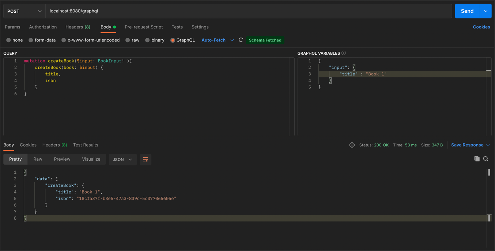
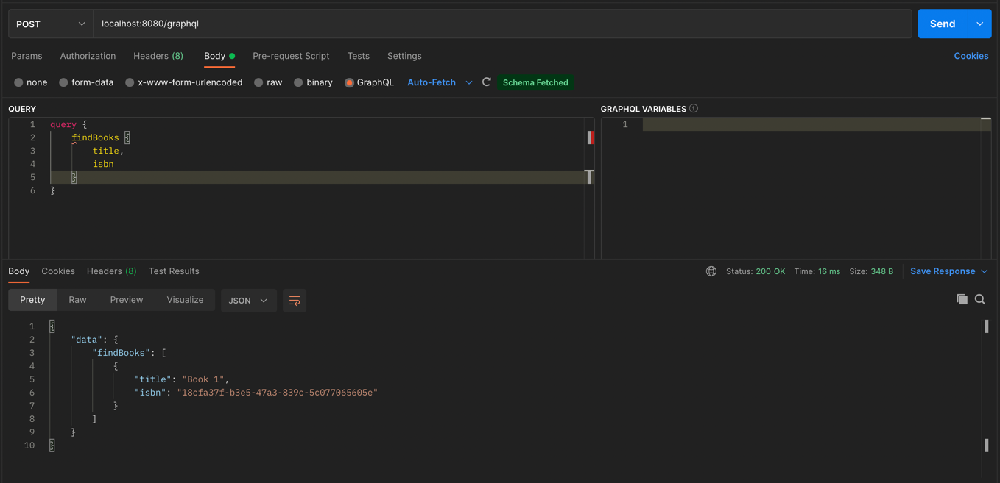
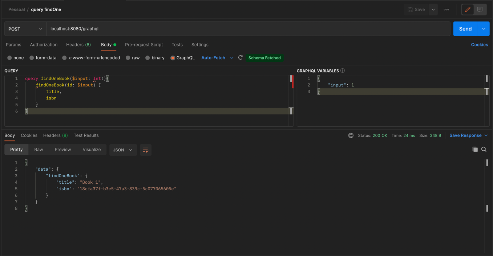

# Projeto GraphQL com Spring Boot

O objetivo deste repositório é ter um exemplo de implementação de GraphQL com Spring Boot simples

## Requisitos
- Java 17

## Exemplo de requisição

Em GraphQL todas as requisições são POST, o que muda é o conteúdo do corpo da requisição<br/>
para fazer uma consulta usamos o type *query* e para inserir, atualizar e remover usamos o type *mutation*.

Neste projeto o endpoint base para requisições é<br/>
`localhost:8080/graphql`

#### Exemplo com CURL para adicionar um item
```
curl -X POST 'localhost:8080/graphql' -H 'Content-Type: application/json' -d '{"query":"mutation createBook($input: BookInput!){createBook(book: $input) {title,isbn}}","variables":{"input":{"title":"Book 1"}}}'
```
#### Exemplo com CURL para listar todos os itens 
```
curl -X POST 'localhost:8080/graphql' -H 'Content-Type: application/json' -d'{"query":"query {findBooks {title,isbn}}","variables":{}}'
```
#### Corpo da requisição para adicionar um item
```
query: "mutation createBook($input: BookInput! ){
    createBook(book: $input) {
        title,
        isbn
    }
}"
variables: "{
    "input": {
        "title" : "Book 1"
    }
}"
```
#### Corpo da requisição para consultar todos
```
query: "query {
    findBooks {
        title,
        isbn
    }
}"
variables: ""
```
#### Corpo da requisição para consultar um por ID
```
query: "query findOneBook($input: Int!){
    findOneBook(id: $input) {
        title,
        isbn
    }
}"
variables: "{
    "input": 1
}"
```

### Exemplo Request Mutation Postman

### Exemplo Request Query Postman

### Exemplo Request Query Com Parâmetros Postman

